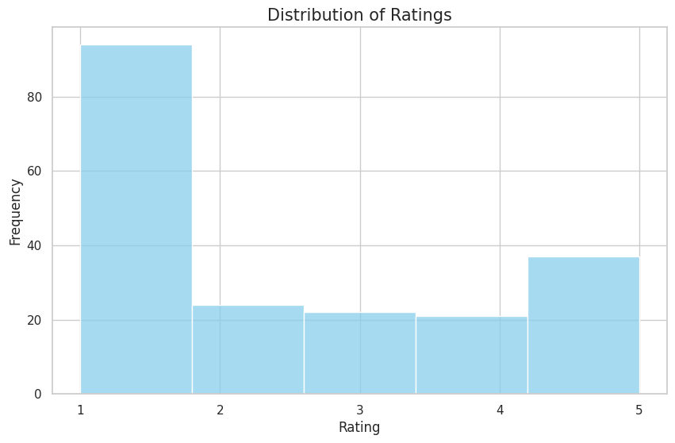
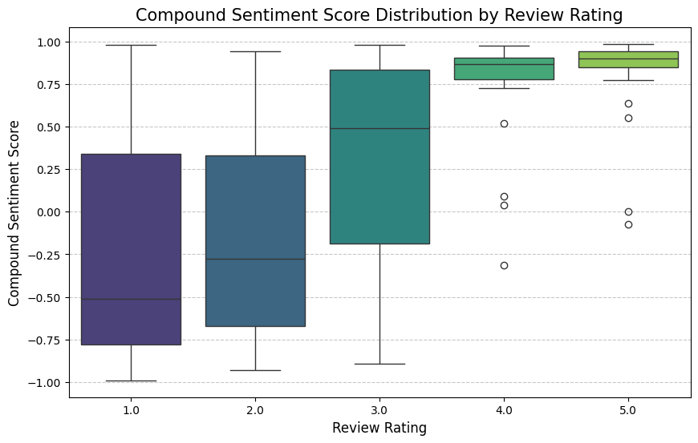
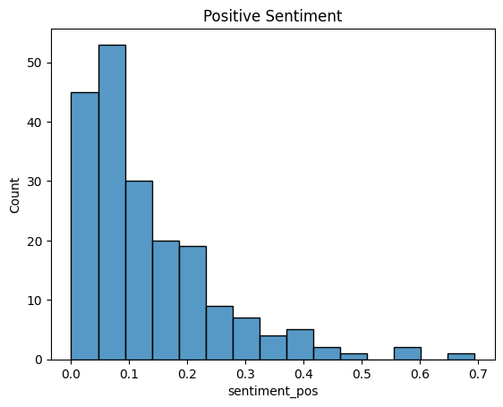
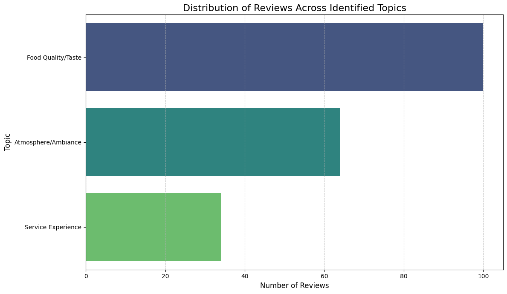
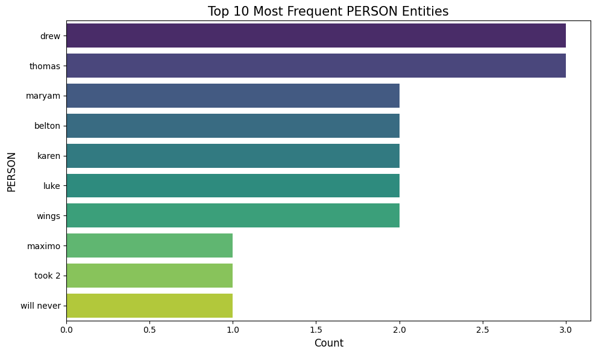
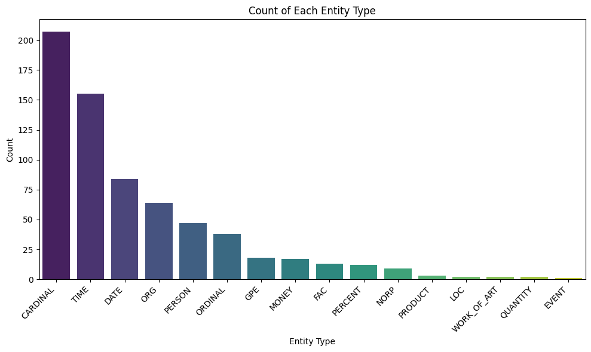
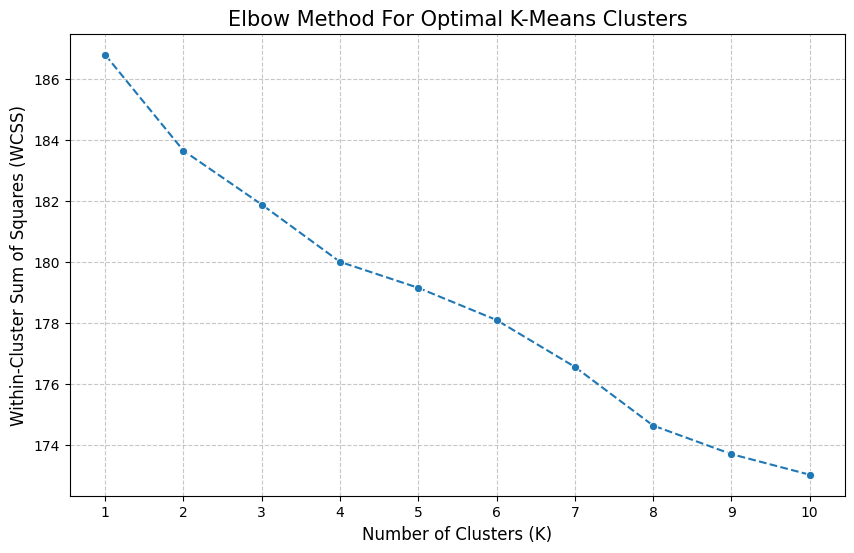

# Customer Review Text Analytics Report: Buffalo Wild Wings

## 1. Business Description
This project analyzes customer reviews for Buffalo Wild Wings, a restaurant operating in the casual dining industry. The business depends on customer satisfaction related to food quality, service delivery, and overall dining experience. Online customer reviews provide valuable insight into customer perceptions and operational performance. This analysis aims to extract meaningful insights from review data to support business improvement.

---

## 2. Dataset Description
The dataset consists of customer reviews collected from Google Reviews using SerpAPI. The dataset includes both textual and numerical variables, allowing for integrated analysis.

### Dataset Features:
- Review text (customer feedback)
- Star ratings (1–5 scale)

The dataset supports:
- Text analytics (sentiment analysis, topic modeling, named entity recognition)
- Numerical analysis (ratings distribution and statistical relationships)

---

## 3. Executive Summary

### 3.1 Data Preparation
The dataset was collected and structured into a usable format. Data cleaning steps ensured consistency and removed any incomplete or irrelevant entries.

**Interpretation:**  
Proper data preparation ensures that the analysis results are accurate and reliable.

---

### 3.2 Distribution of Ratings

**Findings:**  
The distribution shows a concentration of lower ratings (1–2 stars), with fewer high ratings (4–5 stars).

**Business Interpretation:**  
Customer satisfaction is inconsistent, with a significant portion of customers reporting negative experiences.

---

### 3.3 Sentiment Analysis by Rating

**Findings:**  
- Reviews with ratings of 1 and 2 show predominantly negative sentiment  
- Reviews with ratings of 4 and 5 show strong positive sentiment  

**Business Interpretation:**  
There is a clear relationship between customer ratings and sentiment, indicating that emotional experience directly influences ratings.

---

### 3.4 Sentiment Distribution

**Findings:**  
Positive sentiment scores are generally low and not widely distributed.

**Business Interpretation:**  
The business is not consistently delivering highly positive customer experiences.

---

### 3.5 Topic Distribution

**Findings:**  
- Food quality is the most frequently discussed topic  
- Atmosphere is the second most discussed  
- Service experience appears less frequent but remains important  

**Business Interpretation:**  
Customers focus primarily on food quality, but service-related issues contribute significantly to dissatisfaction.

---

### 3.6 Named Entity Recognition

**Findings:**  
The analysis identifies frequent references to individuals, time-related expressions, and organizational elements.

**Business Interpretation:**  
Customer experiences are influenced by interactions with staff and timing factors such as wait times.

---

### 3.7 Clustering Analysis

**Findings:**  
The elbow method suggests an optimal number of clusters between 3 and 4.

**Business Interpretation:**  
Customers can be segmented into distinct groups such as satisfied, neutral, and dissatisfied, allowing targeted operational improvements.

---

## 4. Integration of Text and Numerical Analysis

This project combines textual data (customer reviews) with numerical data (ratings) to provide a comprehensive analysis.

### Key Result:
- Correlation between sentiment and rating: 0.63

### Interpretation:
There is a strong positive relationship between sentiment scores and numerical ratings. Ratings indicate the level of satisfaction, while text explains the underlying reasons.

### Benefit to the Business:
This combined approach enables the business to understand not only customer satisfaction levels but also the causes behind those perceptions, leading to more informed decision-making.

---

## 5. Key Findings

- Customer satisfaction levels are inconsistent  
- Negative experiences are primarily associated with service quality  
- Food quality is a central focus but not the main source of dissatisfaction  
- Wait times and staff interactions significantly influence customer perception  
- Sentiment and ratings are strongly correlated  

---

## 6. Operational Recommendations

Based on the findings, the business should consider the following actions:

1. Improve service efficiency, particularly during peak hours  
2. Provide staff training to enhance customer interaction and professionalism  
3. Implement regular monitoring of customer reviews using sentiment analysis  
4. Address recurring complaints related to service delays and food quality  
5. Use customer feedback as a basis for continuous operational improvement  

---

## 7. Project Files

- CIS617_FINAL_CLEAN.ipynb: Full analysis notebook  
- Data Collection: Reviews were retrieved dynamically from Google Maps using SerpAPI 
- images/: Directory containing charts and visualizations  

---

## 8. Tools and Technologies

- Python  
- Pandas  
- Matplotlib and Seaborn  
- Natural Language Processing techniques (Sentiment Analysis, Topic Modeling, Named Entity Recognition)  
- Google Colab  

---

## 9. Conclusion

This project demonstrates the value of combining text analytics with numerical analysis to understand customer feedback. The results provide actionable insights that can support improved service delivery, enhanced customer satisfaction, and more effective business decision-making.
